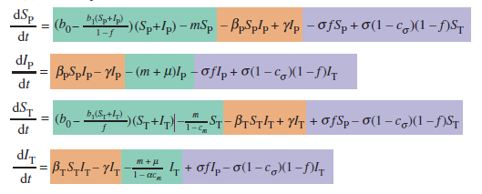
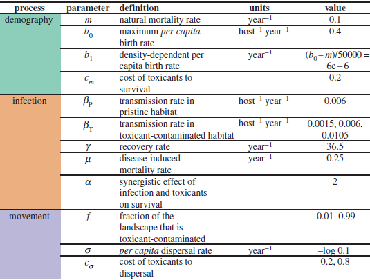

```{r setup, include=FALSE}
knitr::opts_chunk$set(echo = TRUE)
```
\newpage
## Introduction
Heavy metal pollution due to urbanization has a serious impact on humans and animals. In addition, the exposure to those toxicants can influence negative effects of virus infections on individual hosts, but also altering animal movement. To understand this, a hypothetical flying fox species is infected with a virus and a mathematical model explores the infection dynamics in toxicant-contaminated landscapes.  
Flying foxes are often used as bioindicators for heavy metal pollution, because they have a broad range of different habitats. They feed on fruiting plants in human environments, where they face exposure to heavy metals. Another reason why flying fox species are used in this model is because they are reservoir hosts of a virus named henipavirus. This virus can be transmitted to humans and other animals.

\newpage
## Methods
This section is divided into two parts: the software and the model. The software part lists the programming language and packages that have been used, with their corresponding versions. The model part lists the differential equations. This is followed by the definitions and values of each parameter of each value is then discussed. 

The code used in this project is written used R version 4.1.3. In R the DeSolve package (version 1.32) is imported in order to model the differential equations, which are shown below. 

The model is set-up using the following differential equations:
```{r, echo=FALSE, fig.cap="\\textit{differential equations used by the model. Each differential equation is highlighted by different color; green represents demography paramters, orange represents infection paramters and purple represents movement paramters. Each equation calculates the population size of a different group. The groups are: susceptible animals in a pristine habitat ($S_P$), infected animals in a pristine habitat ($I_P$,) susceptible animals in a toxic contaminated habit ($S_T$) and infected aminals in a toxid contamindated area ($I_T$). Image obtained from SOURCE}", out.width = '70%'}

```
In figure 1 four differential equations are shown. Firstly, $\frac {dS_P}{dt}$ calculates the population size of the susceptible (S) flying foxes which are located in a pristine (P) area. Secondly, $\frac {dI_P}{dt}$ calculates the mount of infected (I) flying foxes in a pristine (P) area. Thirdly, $\frac {dS_T}{dt}$ calculates the amount of flying foxes which are susceptible (S) and in a toxic (T) area. Lastly, $\frac {dI_T}{dt}$ calculates the population size of the flying foxes which are infected (I) and located in a toxic area (T)

Additionally, in figure 1 parts of the differential equations are coloured. Each colour represents a different process which may affect the population size with that infection status and habitat. Green is used to indicate demography, orange to indicate infection and purple to indicate movement.

Each equation is broken down into its parameters and listed below:

```{r, echo=FALSE, fig.cap="\\textit{all of the paramters, definitoins, units and values used in the differential equations. The paramters are divided by demography, infection and movement. Image is obtained from SOURCE} ", out.width = '70%'}

```

As shown in figure 2;  $\beta_T$, $f$ and $\text{population size}$ show variable values. This is based on the different scenarios that are being modulated. In both scenarios (to be discussed shortly) $f$ is being changed, ranging from 0.01 to 0.99 (in steps of 0.01). This is the  amount of landscape that is contaminated by toxicants. For each $f$, the model is run for a timespan of 50 years and the last values are used. This timespan is chosen because all of the differential equations are then at equilibrium. Furthermore, for each scenario the population size, infection prevalence and spillover risk are being calculated using the following formulas: $$\text{Population size} = S_P + I_P + S_T + I_T$$
$$\text{Infection prevelance} = \frac {I_T}{\text{population size}} $$
$$\text{Spillover risk} = \frac {I_T}{f} $$

Coming back to the scenarios, in the first scenario $\beta_T$ is being varied. This is done to simulate the effect of different transmission rates in a toxic contaminated habitat with respect to the transmission rate in a pristine habitat. Three different $\beta_T$ values were used to obtain the following scenarios: *ander woord voor scenarios kiezen*

* $\beta_T < \beta_P$
* $\beta_T = \beta_P$
* $\beta_T > \beta_P$

In the second scenario, the value of $c_\sigma$ is being changed from 0.2 to 0.8. $c_\sigma$ is the cost of toxicants to dispersal of the animal (see figure 2). That is, the ability of an animal of switching from a toxic contaminated habitat to a pristine habitat. When $c_\sigma$ is low the animal can easily move from the toxic to the pristine habitat. On the contrary, if $c_\sigma$ is high it is hard for the animal to move from the toxic to the pristine habitat. Two different values of $c_\sigma$ are used to simulate these events:

* $c_\sigma = 0.2$
* $c_\sigma = 0.8$

\newpage
## Results

As mentioned earlier, two scenarios have been modulated. Firstly the population size, infection prevalence and spillover risk have been modulated for different values of $\beta_t$. Secondly the population size, infection prevalence and spillover risk have been modulated for different $c_\sigma$.

```{r ODEfunction, echo=FALSE, warning=FALSE}
## ODE FUNCTION

# Load deSolve package
library(deSolve)

# Function with the models differential equations
wildlife_urbanization_model <- function(t, state, parameters) {
  with(as.list(c(state, parameters)),{
    
    dSp <- (b0 - (b1 * (Sp + Ip)) /(1-f) ) * (Sp + Ip) - m * Sp -  # demography
      beta_p * Sp * Ip + gamma * Ip -  # infection
      sigma * f * Sp + sigma * (1 - c_sigma) * (1 - f) * St  # movement
    
    
    dIp <-  beta_p * Sp * Ip - gamma * Ip -  # infection
      (m + mu) * Ip -  # demography
      sigma * f * Ip + sigma * (1 - c_sigma) * (1 - f) * It  # movement
    
    
    dSt <- (b0 - (b1 * (St + It) / f)) * (St + It) - (m / (1 - c_m)) * St -  # demography
      beta_t * St * It + gamma * It +  # infection
      sigma * f * Sp - sigma * (1 - c_sigma) * (1 - f) * St  # movement
    
    
    dIt <- beta_t * St * It - gamma * It -  # infection
      ((m + mu) / (1 - alpha * c_m)) * It +  # demography
      sigma * f * Ip - sigma * (1 - c_sigma) * (1 - f) * It  # movement
      
      
    list(c(dSp, dIp, dSt, dIt))
  }) 
}

```

```{r modelfunction, echo=FALSE}
## MODEL FUNCTION

run_model <- function(population = 50000, infected = 100, m = 0.1, b0 = 0.4, 
                      c_m = 0.2, beta_p = 0.006, beta_t = 0.006, gamma = 36.5, 
                      mu = 0.25, alpha = 2, sigma = -log(0.1), c_sigma = 0.2){
  
  # Create a data frame to store needed data
  df <- data.frame(matrix(nrow = 0, ncol = 8))
  colnames(df) <- c('f', 'Sp', 'Ip', 'St', 'It', 
                    'pop_size', 'inf_prevalence', 'spillover')
  
  for (f in seq(0.01, 0.99, 0.01)){
    # Calculate b1 based on the function parameters
    b1 <- (b0 - m) / population
    
    # Calculate infection status per habitat
    Sp <- (population - infected) * (1 - f)
    Ip <- infected * (1 - f)
    St <- (population - infected) * f
    It <- infected * f
    
    # Creating a vector with the parameter values
    parameters <- c(m = m, b0 = b0, b1 = b1, c_m = c_m, beta_p = beta_p, 
                    beta_t = beta_t, gamma = gamma, mu = mu, alpha = alpha, 
                    f = f, sigma = sigma, c_sigma = c_sigma)
  
    # Creating a vector with the initial values
    state<- c(Sp = Sp, Ip = Ip, St = St, It = It)
    
    # Time frame of 50 years
    times <- seq(0, 50, 0.05)
    
    out <- tail(ode(y = state, times = times, func = wildlife_urbanization_model, parms = parameters), 1)
    
    df[nrow(df) + 1,] <- c(f, out[2:5], sum(out[2:5]), (out[3] + out[5])/sum(out[2:5]), out[5]/f)
    }
  
  return(df)
}
```

```{r obtain_data_function, echo=FALSE}
## OBTAIN DATA FUNCTION
obtain_data <- function(c_sigma){
  for (beta_t in c(0.0015, 0.006, 0.0105)){
    df <- run_model(beta_t = beta_t, c_sigma = c_sigma)
    if (beta_t == 0.0015){
      population_all <- data.frame('0.0015' = df$pop_size)
      infection_all <- data.frame('0.0015' = df$inf_prevalence)
      spillover_all <- data.frame('0.0015' = df$spillover)
    }
    if (beta_t == 0.006){
      population_all <- data.frame(population_all, '0.006' = df$pop_size)
      infection_all <- data.frame(infection_all, '0.006' = df$inf_prevalence)
      spillover_all <- data.frame(spillover_all, '0.006' = df$spillover)
    }
    if (beta_t == 0.0105){
      population_all <- data.frame(population_all, '0.0105' = df$pop_size)
      infection_all <- data.frame(infection_all, '0.0105' = df$inf_prevalence)
      spillover_all <- data.frame(spillover_all, '0.0105' = df$spillover)
    }
  }
  return(list(population_all, infection_all, spillover_all))
}
```

```{r plotfunction, echo=FALSE}
## PLOT FUNCTION
plot_scenario <- function(datasets, y_labels, line_cols, legends){
  plot_labels = c("A", "B", "C")
  f_seq = seq(0.01, 0.99, 0.01)
  for (item in 1:length(datasets)){
    data <- datasets[[item]]
    for (scenario in 1:3){
      if (scenario == 1){
        plot(data[,scenario] ~ f_seq, col = line_cols[scenario], 
             type = 'l', lwd = 3, ylim = c(0, max(data) * 1.25),
             xlab = 'f', las = 1, ylab = "")
        title(ylab = y_labels[item], line = 3.3)
        text(x=0.05, y=max(data) * 1.2, labels = plot_labels[item], font = 2)
      }
      else{
        lines(data[,scenario] ~ f_seq, col = line_cols[scenario], lwd = 3)
      }
    }
  }
}
```

### Scenario 1: \boldmath$\beta_t$
```{r beta_t_scenarios, echo=FALSE, fig.cap="modulated population size (A), infection prevalence (B) and spillover risk (C) with respect to the fraction of toxic-contaminated habitat. In all plots the line colors orange, purple and blue indicate beta_T < beta_P, beta_T = beta_P and beta_T < beta_P, respectively. A c_sigma value of 0.2 was used ", fig.width=7}
beta_t_data <- obtain_data(c_sigma = 0.2)
beta_t_labels <- c('population size', 'infection prevealance', 'spillover risk')
beta_t_cols <- c('orange', 'slateblue', 'deepskyblue2')
beta_t_legends <- c(expression(paste(beta[T], " < ", beta[P])),expression(paste(beta[T], " = ", beta[P])),
                    expression(paste(beta[T], " > ", beta[P])))

par(mfrow=c(2,2), mar=c(3.1,5.1,3.1,2.1))
plot_scenario(datasets = beta_t_data, y_labels = beta_t_labels, line_cols = beta_t_cols, 
              legends = beta_t_legends)
legend(1.1, 26000, legend = beta_t_legends, fill = beta_t_cols, xpd=NA)
```

In figure 3 the population size, infection prevalence and spillover risk are shown with varying $\beta_t$ values. 

In figure 3A \textcolor{violet}{\boldmath$\beta_t = \beta_p$} and \textcolor{cyan}{\boldmath$\beta_t > \beta_p$} show a similar trend. When the fraction of contaminant habitat increases ($f$), the population size first increases a little and then declines slowly. However, the population size of \textcolor{violet}{\boldmath$\beta_t = \beta_p$} has a higher increase until it declines resulting in a higher population size at different $f$'s. Interestingly, when looking at \textcolor{orange}{\boldmath$\beta_t < \beta_p$} an increase can be seen until an $f$ of 0.7 is reached, which is way higher when compared to the other scenarios where it increased until approximately 0.15. After an $f$ of 0.7 it declines.

In figure 3B \textcolor{violet}{\boldmath$\beta_t = \beta_p$}and \textcolor{cyan}{\boldmath$\beta_t > \beta_p$} are again very similar. A slow decline of infection prevalence can be seen until an %f% of approximately 0.65 is reached, after which it increases. Furthermore, \textcolor{orange}{\boldmath$\beta_t < \beta_p$} shows a steeper and longer decrease as $f$ increases. It then increases in the same way as\textcolor{violet}{\boldmath$\beta_t = \beta_p$} and \textcolor{cyan}{\boldmath$\beta_t > \beta_p$}.

In figure 3C \textcolor{violet}{\boldmath$\beta_t = \beta_p$} and \textcolor{cyan}{\boldmath$\beta_t > \beta_p$} repeatedly show similar trends. They both have a sharp S-shaped increase with respect to an increasing value of $f$. Hereafter it declines. The same S-shaped increase can be seen when looking at \textcolor{orange}{\boldmath$\beta_t < \beta_p$}. However, this increases is less steep and the optimum is reached at a higher $f$. Furthermore, when the optimum is reached it does not decline at all.

Altogether it seems like a similar trend in all graphs of figure 3 can be seen. \textcolor{violet}{\boldmath$\beta_t = \beta_p$} and \textcolor{cyan}{\boldmath$\beta_t > \beta_p$} show very similar curves, where \textcolor{violet}{\boldmath$\beta_t = \beta_p$} is delayed or more spread out. When looking at  \textcolor{orange}{\boldmath$\beta_t < \beta_p$} the same phenomenon can be seen, but more extreme. The increases and decreases are less steep and take longer with respect to an increasing $f$.

### Scenario 2: population size


```{r c_sigma_scenarios ,echo=FALSE, fig.cap="\\textit{ modulated population size (A), infection prevalence (B) and spillover risk (C) with respect to the fraction of toxic-contaminated habitat. In all plots the line colors orange, purple and blue indicate beta_T < beta_P, beta_T = beta_P and beta_T < beta_P, respectively. A c_sigma value of 0.8 was used } ", fig.width=7}
beta_t_data <- obtain_data(c_sigma = 0.8)
beta_t_labels <- c('population size', 'infection prevealance', 'spillover risk')
beta_t_cols <- c('orange', 'slateblue', 'deepskyblue2')
beta_t_legends <- c(expression(paste(beta[T], " < ", beta[P])),expression(paste(beta[T], " = ", beta[P])),
                    expression(paste(beta[T], " > ", beta[P])))


par(mfrow=c(2,2), mar=c(3.1,5.1,3.1,2.1))
plot_scenario(datasets = beta_t_data, y_labels = beta_t_labels, line_cols = beta_t_cols, 
              legends = beta_t_legends)
legend(1.1, 26000, legend = beta_t_legends, fill = beta_t_cols, xpd=NA)
```

In figure 4 the population size, infection prevalence and spillover risk are shown with varying $\beta_T$ values. These graphs will be mostly compared to the graphs in figure 3.

Figure 4A and figure 3A show some similarities. Firstly, the lines of \textcolor{violet}{\boldmath$\beta_t = \beta_p$} and \textcolor{cyan}{\boldmath$\beta_t > \beta_p$} are in both graphs very close together and show a similar trend. \textcolor{orange}{\boldmath$\beta_t < \beta_p$} is in both cases distant from the other two lines and shows a similar yet more extreme trend. However, \textcolor{orange}{\boldmath$\beta_t < \beta_p$} in figure 4A shows more of a kink at the inflection point, compared to a curve in figure 3A. This inflection point is also at a lower $f$, that is, it is a shifted to the right. \textcolor{orange}{\boldmath$\beta_t < \beta_p$} also hs a lower maximum at this point of inflection.

The graph illustrated in figure 4B and figure 3B show a similar pattern in a way that  \textcolor{violet}{\boldmath$\beta_t = \beta_p$}, \textcolor{cyan}{\boldmath$\beta_t > \beta_p$} and \textcolor{orange}{\boldmath$\beta_t < \beta_p$} and first decline and then increase. In addition, the values of where the lines start and end are the same in figure 4B and 3B. However, the point of inflection happens at a lower $f$ and the minimum of the line is lower. This results in a more stiff decrease and increase.

When looking at figure 4C compared to figure 3C, the following can be noticed. The lines in figure 4C are similar but more compressed and shifted to the left. In addition, the spillover risk values of the peaks are higher. This results in a more steep increase. Interestingly, when looking at \textcolor{orange}{\boldmath$\beta_t < \beta_p$} in figure 4C a flatline can be seen until an $f$ of 0.4 is reached. 

Collectively, all graphs in figure 4 are unlike in way that the lines are shifted to the right when compared to figure 3. On the contrary, similar values of the start and stop values can be seen in all graphs (A, B and C) and lines. 


\newpage
## Discussion

\newpage
## References

\newpage
## Apendix
```{r ODEfunction, eval=FALSE}
```

```{r modelfunction, eval=FALSE}
```

```{r plotfunction, eval=FALSE}
```

```{r loopfunction, eval=FALSE}
```

```{r beta_t_scenarios, eval=FALSE}
```