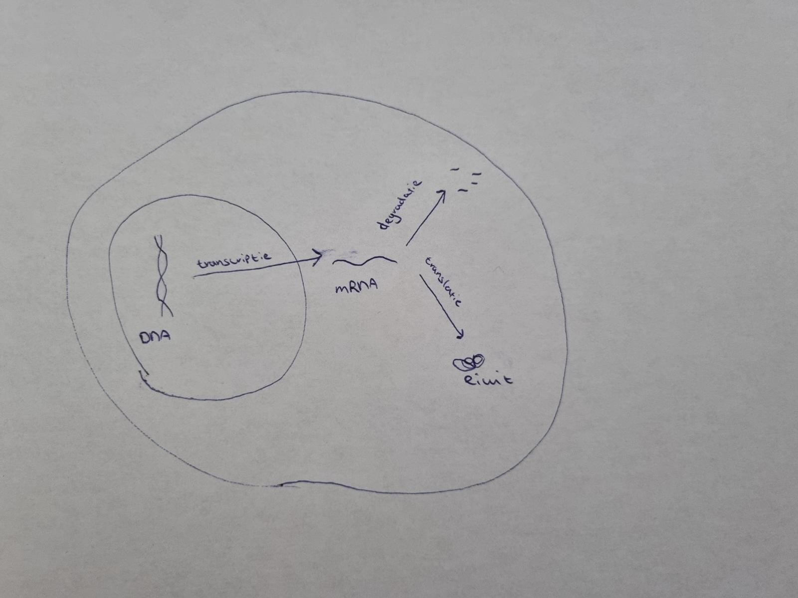

## 1.0 opdracht

dR/dt = -rR + m

R is the number of transcripts

r is the rate of decay of existing transcripts

m is the number of new transcripts produced per second


[1] Welke parameters moet je programmeren?

* Snelheid van de afbraak van de transcripten (r)
* Nummer van de nieuwe transcripten per seconde (m)

[2] Zoek bronnen op internet die uitleggen waar de formule dR/dt = -rR + m vandaan komt

De hoeveelheid mRNA hangt af van zowel de synthese (transcriptie) en degradatie snelheden.
https://www.uv.es/gfl/documentos/bioessays.pdf
https://www.sciencedirect.com/science/article/pii/S2452310019300058

[3]



De mRNA concentratie in een cel hangt af van de synthese/transcriptie, maar ook van de degradatie van het mRNA. Als de snelheid van de mRNA synthese groter is dan de snelheid van de degradatie neemt de concentratie mRNA toe. Als de snelheid van de mRNA synthese kleiner is dan de snelheid van de degradatie neet mde concentratie mRNA af.


[4] Wat is de return waarde van de model functie in R? Waarom return je die en niet R zelf?
dR/dt

Je wilt weten wat de verandering is over de tijd en niet alleen op een bepaalde tijd. 

## 2.0 Programmeeropdracht
```{r}
library(deSolve)

mRNA.dynamic <- function(t, state, paramters) {
  with(as.list(c(state, paramters)),{
    dR.dt <- -r * R + m
    list(c(dR.dt))
  }) 
}

parameters <- c(r = 0.1, m = 10) 
state <- c(R = 100)
times <- seq(0, 100)
out.steady <- ode(y = state, times = times, func = mRNA.dynamic, parms = parameters)

parameters <- c(r = 0.1, m = 12) 
state <- c(R = 100)
times <- seq(0, 100)
out.increase <- ode(y = state, times = times, func = mRNA.dynamic, parms = parameters)

parameters <- c(r = 0.1, m = 8) 
state <- c(R = 100)
times <- seq(0, 100)
out.decrease <- ode(y = state, times = times, func = mRNA.dynamic, parms = parameters)

plot(out.steady, col = "red",
     main = "mRNA decay for different models",
     xlab = "time (s)", ylab = "# of mRNA transcripts")
lines(out.increase, col = "green")
lines(out.decrease, col = "blue")

legend(x = 0, y = 140, legend=c("increase", "steady", "decrease"), col=c("green", "red", "blue"),
       lty=1, box.lty=0, cex=0.8)
```
