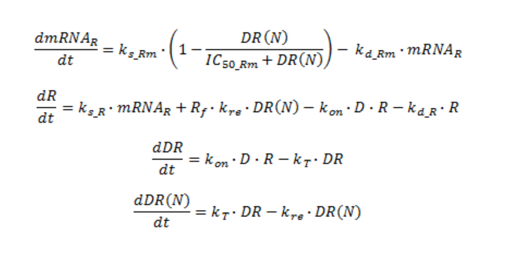

```{r setup, include=FALSE}
knitr::opts_chunk$set(echo = TRUE)
```

# Introduction

Glucocorticoids (GC) are a type of steroid hormones which are used by the immune system to repress inflammation. For this reason GCs are used as a medicine to treat inflammation in inflammatory diseases like asthma. The anti-inflammatory process caused by GCs can be divided into two processes: trans-repression and trans-activation. In trans-repression some inflammatory genes are suppressed by binding of the GCs to GC receptors (GR). This causes histon deacetylation of these genes and this causes for less transcription. In trans-activation the GRs activate transcription of anti-inflammatory genes by binding to DNA recognition sites on these genes. This activation is achieved by histon acetylation.

Using a model


# Method
First data from an experiment is compared with simulation data, to asses model validity. Then results of a change in the model or modelparameters are compared to a basic scenario. 


Below a flow diagram and the differential equations of glucorticoide receptor dynamics describe the model. 


{width=49%} 
{width=49%}

Here, D is the plasma concentration of MPL, mRNAR the quantity of receptor mRNA, R the density of glucocorticoide receptor in the cytosol, DR the density of the MPL-receptor complex and DR(N) the quantity of the MPL-receptor complex in the nucleus. Ks_Rm is the zero order rate constant of mRNA synthesis and kd_Rm the first order rate constant of mRNA degradation. Ks_R and kd_R are the first order rate constant of respectively the synthesis and degradation of the receptor. KT is the first order rate constant for the translocation of the MPL-receptor complex to the nucleus and kre is the first order rate constant for the transport of the receptor from the nucleus to the cytosol. Kon is the second order rate constant for the formation of the MPL-receptor complex. Rf is the fraction free receptor that is recycled and IC_50Rm is the concentration DR(N) where the synthesis of receptor mRNA decreases till 50% of the initial value. 

### Parameters and values
Here follow the parameters and values used in the model, these are the values for the basic scenario. 

| Parameter                 | Value               |
|---------------------------|---------------------|
|ks_Rm (fmol/g liver/h)     |2.90                 |
|IC50_Rm (fmol/mg protein)  |26.2                 |
|kon (L/nmol/h)             |0.00329              |
|kT (1 / h)                 |0.63                 |
|kre (1 / h)                |0.57                 |
|Rf                         |0.49                 |
|kd_R (1 / h)               |0.0572               |
|kd_Rm                      |0.612                |
|ks_r                       |3.22                 | 
|D (nmol/L)                 |20 * 1000 * 1/374.471|

### Initial values
Here follow the initial values of the variables, these are the values for the basic scenario.

| Variables                 | Value               |
|---------------------------|---------------------|
|mRNAR (fmol / g liver)     |4.74                 |
|R (fmol/mg protein)        |267                  |
|DR (fmol/mg protein)       |0                    |
|DR(N) (fmol/mg protein)    |0                    |


## Assess model validity
To asses model validity, data from experimental data for two doses are compared with the simulation data. In the experiment MPL was administered for 7 days under constant infusion of 0.1 or 0.3 mg drug/kg rat/h. The concentration of the drug, receptor mRNA and the free receptor were measured. 


### Dependence of the results on the dose and concentration of the drug
The model variables mRNA,= and R are compared with the experimental data by running simulations and adjusting dosis D. 

```{r warning=FALSE}
library(deSolve)

corticosteroid <- function(t, state, paramters) {
  with(as.list(c(state, paramters)),{
    dmRNAr <- ks.Rm * (1 - DR.N / (IC50.Rm + DR.N)) - k.dRm * mRNAr
    
    dR <- k.sR * mRNAr + Rf * k.re * DR.N - k.on * D * R - k.dR * R
    
    dDR <- k.on * D * R - k.T * DR
    
    dDR.N <- k.T * DR - k.re * DR.N
    
    list(c(dmRNAr, dR, dDR, dDR.N))
  }) 
}

parameters <- c(ks.Rm = 2.90,
                IC50.Rm = 26.2,
                k.on = 0.00329,
                k.T = 0.63,
                k.re = 0.57,
                Rf = 0.49,
                k.dR = 0.0572,
                k.dRm = 0.612,
                k.sR = 3.22,
                D = 20 * 1000 * 1/374.471 )

state <- c(mRNAr = 4.74,
           R = 267,
           DR = 0,
           DR.N = 0)

times <- seq(0, 48)

out.normal <- ode(y = state, times = times, func = corticosteroid, parms = parameters)

parameters['D'] <- 80 * 1000 * 1/374.471 
out.high <- ode(y = state, times = times, func = corticosteroid, parms = parameters)

parameters['D'] <- 1 * 1000 * 1/374.471 
out.low <- ode(y = state, times = times, func = corticosteroid, parms = parameters)

par(mfrow = c(1,2), mar = c(8.1, 4.1, 8.1, 1.1))

plot(out.normal[,1], out.normal[,2], las = 1, main = "mRNAr", ylim = c(0, 5), type = "l",
     xlab = "time (h)", ylab = "receptor mRNA")
lines(out.high[,2] ~ out.normal[,1], col = "red")
lines(out.low[,2] ~ out.normal[,1], col = "green")

plot(out.normal[,1], out.normal[,3], las = 1, main = "R", ylim = c(0, 275), type = "l",
     xlab = "time (h)", ylab = "free receptor density ")
lines(out.high[,3] ~ out.normal[,1], col = "red")
lines(out.low[,3] ~ out.normal[,1], col = "green")

legend(x = -27, y = -100, legend = c("low dosis", "normal dosis", "high dosis"), fill = c("green", "black", "red"), cex = 0.9, xpd=NA)
```


* mRNAr  
The concentration of mRNAr is influenced by the MPL concentration. When a lower MPL concentration is used the mRNAr is decreasing slower. The DR(N) affects the mRNAr synthesis, this DR(N) concentration is lower when there is less MPL and therefore the mRNAr does not decrease as much. When a higher dosis is used the mRNAr is decreasing more rapidly and a lower end concentration at equilibrium can be seen. This is becuase the medicine can bind to more receptors, which results in more DR and therefore more DR(N). The IC50 value is reached earlier and the mRNAr concentration gets decreased.

* R  
The R concentration decreases less when using a lower MPL concentration. This is due to the fact that there is less MPL to create a MPL-receptor complex, so the R concentration stays high. The opposite can be seen when using a higher MPL concentration. The receptor concentration decreases very fast and has a lower end concentration. This is because there is more medicine to bind to the receptor, resulting in a lower receptor concentration.


### Model results vs experimental data
To see if the model results are inline with the experimental data, a mRNA plot is made. Here it is easy to compare the model (black line) with the experiment (datapoint). The median (red line) is also in the plot because the median is less sensitive for possible outliers. If a certain value is very high or very low this does not affect the value of the median. When compared to the mean, for example, this does get affected by an outlier.

```{r}
MPL <- read.csv("MPL.csv")
```

```{r}
dose.0.1 <- MPL[MPL$dose == 0.1,]
dose.0.3 <- MPL[MPL$dose == 0.3,]

medians <- aggregate(MPL[,c("MPL_conc","mRNA","Free_receptor")],list(MPL$dose,MPL$time), median, na.rm=T)
names(medians)[1:2] <- c("dose","time")

median.0.1 <- medians[medians$dose == 0.1,]
median.0.3 <- medians[medians$dose == 0.3,]

# Changes states of model from medians on time = 0
state['mRNAr'] <- medians[medians$time == 0,]$mRNA
state['R'] <- medians[medians$time == 0,]$Free_receptor

# Change the duration of the model with time points from experimental data
times <- unique(MPL$time)

# Change dosis concentration parameter (D) for 0.1 dosis
median_MPL_01 <- median(MPL$MPL_conc[MPL$dose==0.1], na.rm=T)
parameters['D'] <- median_MPL_01 * 1000 * 1/374.471

# Simulate model for 0.1 dosis
out.0.1 <- ode(y = state, times = times, func = corticosteroid, parms = parameters)

# Change dosis concentration parameter (D) for 0.3 dosis
median_MPL_03 <- median(MPL$MPL_conc[MPL$dose==0.3], na.rm=T)
parameters['D'] <- median_MPL_03 * 1000 * 1/374.471

# Simulate model for 0.3 dosis
out.0.3 <- ode(y = state, times = times, func = corticosteroid, parms = parameters)

par(mfrow = c(2,2), cex = 0.8)

# Plot mRNA plot for 0.1 dose
plot(dose.0.1$mRNA ~ dose.0.1$time,
     xlab = "time", ylab = "mRNAr concentration", main = "mRNAr plot of dosis 0.1", las =1)
points(median.0.1$mRNA ~ median.0.1$time, col = "red", type = "l")
lines(out.0.1[,1], out.0.1[,2])

# Plot Free Receptor points for 0.1 dose
plot(dose.0.1$Free_receptor ~ dose.0.1$time,
     xlab = "time", ylab = "Free Receptor concentration", main = "Free Receptor plot of dosis 0.1", las = 1)
points(median.0.1$Free_receptor ~ median.0.1$time, col = "red", type = "l")
lines(out.0.1[,1], out.0.1[,3])

# Plot mRNA plot for 0.3 dose
plot(dose.0.3$mRNA ~ dose.0.3$time,
     xlab = "time", ylab = "mRNAr concentration", main = "mRNAr plot of dosis 0.3", las =1 )
points(median.0.3$mRNA ~ median.0.3$time, col = "red", type = "l")
lines(out.0.3[,1], out.0.3[,2])

# Plot Free Receptor points for 0.3 dose
plot(dose.0.3$Free_receptor ~ dose.0.3$time,
     xlab = "time", ylab = "Free Receptor concentration", main = "Free Receptor plot of dosis 0.3", las = 1)
points(median.0.3$Free_receptor ~ median.0.3$time, col = "red", type = "l")
lines(out.0.3[,1], out.0.3[,3])
```

The results of the model are not in line with experimental data, but this differs between the plots. The free receptor plots (both doses) are somewhat similar of that of the model, except for one outlier at a time of 50. The mRNAr plots show way less similarities, where the experimental line fluctuates a lot. 

This may be caused by the structure of the data. Firstly, the data is divided in a strange way. In the beginning there are a lot datapoints and at a higher time less. Secondly, there are not many datapoints per time unit to reliable fit the data. Lastly, the experimental data may contain some bias due to measurement errors or other factors that can influence the concentration of mRNAr or free receptor.


## Simulate scenario’s
Here different scenarios are simulated to see what happends if the model and model parameters are changed, the results are compared to the basic scenario. 


### No auto-regulation of glucocorticoid receptor
Here the time course concentration of the activated drug-receptor complex is plotted if there was no effect of drug on the synthesis of the receptor mRNA. The first formula has to be changed, because DR(N) has an effect on the synthesis of the receptor mRNA. 

```{r}
corticosteroid <- function(t, state, parameters) {
  with(as.list(c(state, parameters)),{
    dmRNAr <- ks.Rm * (1 - DR.N * 0 / (IC50.Rm + DR.N * 0)) - k.dRm * mRNAr
    
    dR <- k.sR * mRNAr + Rf * k.re * DR.N - k.on * D * R - k.dR * R
    
    dDR <- k.on * D * R - k.T * DR
    
    dDR.N <- k.T * DR - k.re * DR.N
    
    list(c(dmRNAr, dR, dDR, dDR.N))
  }) 
}

parameters <- c(ks.Rm = 2.90,
                IC50.Rm = 26.2,
                k.on = 0.00329,
                k.T = 0.63,
                k.re = 0.57,
                Rf = 0.49,
                k.dR = 0.0572,
                k.dRm = 0.612,
                k.sR = 3.22,
                D = 20 * 1000 * 1/374.471 )

state <- c(mRNAr = 4.74,
           R = 267,
           DR = 0,
           DR.N = 0)

times <- seq(0, 48)

out.changed <- ode(y = state, times = times, func = corticosteroid, parms = parameters)

par(mfrow = c(2,2))

plot(out.normal[,2] ~ out.normal[,1], las = 1, type = "l", ylab = "mRNAr concentration", xlab = "time", main = "mRNAr", ylim = c(0,5))
lines(out.changed[,2] ~ out.changed[,1], col= "red")

plot(out.normal[,3] ~ out.normal[,1], las = 1, type = "l", ylab = "R concentration", xlab = "time", main = "R",
     ylim = c(0, 275))
lines(out.changed[,3] ~ out.changed[,1], col = "red")

plot(out.normal[,4] ~ out.normal[,1], las = 1, type = "l", ylab = "DR concentration", xlab = "time", main = "DR", ylim = c(0,60))
lines(out.changed[,4] ~ out.changed[,1], col = "red")

plot(out.normal[,5] ~ out.normal[,1], las = 1,type = "l", ylab = "DR(N) concentration", xlab = "time", main = "DR(N)", ylim = c(0,60))
lines(out.changed[,5] ~ out.changed[,1], col = "red")

legend(x = -25, y = 115, legend = c("normal", "No auto-regulation \nof glucocorticoid receptor"), 
       fill = c("black", "red"), xpd = NA, cex = 0.8)
```

When there is no auto-regulation of glucocorticoid receptor, the mRNAr concentration stays steady at the initial value. This is because DR(N) does not inhibit the sythesis of mRNAr. So mRNAr makes receptors, the mRNAr concentration decrease, but also new mRNAr is synthesized, the mRNAr concentration increases. this leads to a steady concentration of mRNAr and a higher concentration of receptor. This also leads to more medicine-receptor complexes in the cytosol (DR) and nucleus (DR(N)).

### Drug treatment is stopped
The time course of receptor and mRNA concentrations is plotted when the drug treatment is stopped. So After the steady state is reached, D is set to zero and the simulation continues till the new steady state is reached.

```{r}
corticosteroid <- function(t, state, paramters) {
  with(as.list(c(state, paramters)),{
    dmRNAr <- ks.Rm * (1 - DR.N / (IC50.Rm + DR.N)) - k.dRm * mRNAr
    
    dR <- k.sR * mRNAr + Rf * k.re * DR.N - k.on * D * R - k.dR * R
    
    dDR <- k.on * D * R - k.T * DR
    
    dDR.N <- k.T * DR - k.re * DR.N
    
    list(c(dmRNAr, dR, dDR, dDR.N))
  }) 
}

parameters <- c(ks.Rm = 2.90,
                IC50.Rm = 26.2,
                k.on = 0.00329,
                k.T = 0.63,
                k.re = 0.57,
                Rf = 0.49,
                k.dR = 0.0572,
                k.dRm = 0.612,
                k.sR = 3.22,
                D = 20 * 1000 * 1/374.471 )

state <- c(mRNAr = 4.74,
           R = 267,
           DR = 0,
           DR.N = 0)

t.steady <- seq(0, 35)
t.steady.second <- seq(35, 100)

out.steady <- ode(y = state, times = t.steady, func = corticosteroid, parms = parameters)
parameters['D'] <- 0
out.steady.second <- ode(y = tail(out.steady, 1)[,-1], times = t.steady.second, func = corticosteroid, parms = parameters)

par(mfrow = c(2,2))

plot(out.steady[,2] ~ out.steady[,1], las = 1, xlim = c(0, 100), type = "l", ylab = "mRNAr concentration", xlab = "time", main = "mRNAr")
lines( out.steady.second[,2] ~ out.steady.second[,1])

plot(out.steady[,3] ~ out.steady[,1], las = 1, xlim = c(0, 100), type = "l", ylab = "R concentration", xlab = "time", main = "R")
lines( out.steady.second[,3] ~ out.steady.second[,1])

plot(out.steady[,4] ~ out.steady[,1], las = 1, xlim = c(0, 100), type = "l", ylab = "DR", xlab = "time", main = "R")
lines( out.steady.second[,4] ~ out.steady.second[,1])

plot(out.steady[,5] ~ out.steady[,1], las = 1, xlim = c(0, 100), type = "l", ylab = "DR(N)", xlab = "time", main = "R")
lines( out.steady.second[,5] ~ out.steady.second[,1])
```

We see that the mRNAr and R concentration first decrease a lot, because there is drug present. And then reaches a steady state, then when the drug treatment is stopped, the mRNAr and receptor concentration increase back to the initial value. This is because medicine-receptor complexes are no longer made, and the synthesis of mRNAr is no longer inhibited. 

### Different association and dissociation rates from receptors
Different corticosteroids show different association rates from receptors (kon) and different dissociation rates (in this model reflected by kre). The same concentrations of the drug is assumed and the effect of different values of kon and kre (consider 2 and 5 times increase and decrease of both parameters separately) on the receptor and mRNA dynamics is plotted. kon and kre are adjusted as below and plot the results of the simulation for each change. 
Simulations are run for 4 new values of kon: 0.00329/5, 0.00329/2, 0.00329\*2 and 0.003291\*5. The results are compared to the basic scenario when kon=0.00329
Separately, simulations are run for 4 new values of kre: 0.57/5, 0.57/2, 0.57\*2 and 0.57*5. The results should are compared to the basic scenario when kre= 0.57

```{r}
corticosteroid <- function(t, state, paramters) {
  with(as.list(c(state, paramters)),{
    dmRNAr <- ks.Rm * (1 - DR.N / (IC50.Rm + DR.N)) - k.dRm * mRNAr
    
    dR <- k.sR * mRNAr + Rf * k.re * DR.N - k.on * D * R - k.dR * R
    
    dDR <- k.on * D * R - k.T * DR
    
    dDR.N <- k.T * DR - k.re * DR.N
    
    list(c(dmRNAr, dR, dDR, dDR.N))
  }) 
}

parameters <- c(ks.Rm = 2.90,
                IC50.Rm = 26.2,
                k.on = 0.00329,
                k.T = 0.63,
                k.re = 0.57,
                Rf = 0.49,
                k.dR = 0.0572,
                k.dRm = 0.612,
                k.sR = 3.22,
                D = 20 * 1000 * 1/374.471 )

state <- c(mRNAr = 4.74,
           R = 267,
           DR = 0,
           DR.N = 0)

t.steady <- seq(0, 48)

kon.normal <- ode(y = state, times = t.steady, func = corticosteroid, parms = parameters)
parameters['k.on'] <- 0.00329 * 2
kon.increase2 <- ode(y = state, times = t.steady, func = corticosteroid, parms = parameters)
parameters['k.on'] <- 0.00329 * 5
kon.incerease5 <- ode(y = state, times = t.steady, func = corticosteroid, parms = parameters)
parameters['k.on'] <- 0.00329 / 2
kon.decrease2 <- ode(y = state, times = t.steady, func = corticosteroid, parms = parameters)
parameters['k.on'] <- 0.00329 / 5
kon.decrease5 <- ode(y = state, times = t.steady, func = corticosteroid, parms = parameters)


parameters['k.on'] <- 0.00329

kre.normal <- ode(y = state, times = t.steady, func = corticosteroid, parms = parameters)
parameters['k.re'] <- 0.57 * 2
kre.increase2 <- ode(y = state, times = t.steady, func = corticosteroid, parms = parameters)
parameters['k.re'] <- 0.57 * 5
kre.incerease5 <- ode(y = state, times = t.steady, func = corticosteroid, parms = parameters)
parameters['k.re'] <- 0.57 / 2
kre.decrease2 <- ode(y = state, times = t.steady, func = corticosteroid, parms = parameters)
parameters['k.re'] <- 0.57 / 5
kre.decrease5 <- ode(y = state, times = t.steady, func = corticosteroid, parms = parameters)
```

```{r}
par(mfrow = c(2,2))
plot(kon.normal[,2] ~ kon.normal[,1], type = 'l', ylim = c(0, 5),
     xlab = "time", ylab = "mRNAr concentration", main = "mRNAr when k.on is changed")
lines(kon.increase2[,2]~ kon.normal[,1], col = 'red')
lines(kon.incerease5[,2]~ kon.normal[,1], col = 'green')
lines(kon.decrease2[,2]~ kon.normal[,1], col = 'blue')
lines(kon.decrease5[,2]~ kon.normal[,1], col = "orange")

plot(kon.normal[,3] ~ kon.normal[,1], type = 'l',ylim = c(0, 300),
     xlab = "time", ylab = "free receptor", main = "R when k.on is changed")
lines(kon.increase2[,3]~ kon.normal[,1], col = 'red')
lines(kon.incerease5[,3]~ kon.normal[,1], col = 'green')
lines(kon.decrease2[,3]~ kon.normal[,1], col = 'blue')
lines(kon.decrease5[,3]~ kon.normal[,1], col = "orange")

plot(kre.normal[,2] ~ kon.normal[,1], type = 'l', ylim = c(0, 5),
     xlab = "time", ylab = "mRNAr concentration", main = "mRNAr when k.er is changed")
lines(kre.increase2[,2]~ kon.normal[,1], col = 'red')
lines(kre.incerease5[,2]~ kon.normal[,1], col = 'green')
lines(kre.decrease2[,2]~ kon.normal[,1], col = 'blue')
lines(kre.decrease5[,2]~ kon.normal[,1], col = "orange")

plot(kre.normal[,3] ~ kon.normal[,1], type = 'l',ylim = c(0, 300),
     xlab = "time", ylab = "free receptor", main = "R when k.er is changed")
lines(kre.increase2[,3]~ kon.normal[,1], col = 'red')
lines(kre.incerease5[,3]~ kon.normal[,1], col = 'green')
lines(kre.decrease2[,3]~ kon.normal[,1], col = 'blue')
lines(kre.decrease5[,3]~ kon.normal[,1], col = "orange")

legend(x = -22, y = 650, legend = c("normal", "increase2", "incease5", "decrease2", "decrease5"), 
       fill = c("black", "red", "green", "blue", "orange"), xpd = NA, cex = 0.9)
```

k.on is the rate of the formation of the medicine-receptor complex  
k.er is the rate of the translocation of the receptor from the nucleus to the cytosol

* mRNAr when k.on is changed  
When the k.on rate is increased, the mRNAr concentration decreases because k.on causes an increase in medicine-receptor complexes, which in turn increases more medicine-receptor complexes in the nucleus. And this increases leads to reaching faster of the IC50 value, which lowers the mRNAr synthesis. When the k.on rate is decreased, the mRNAr concentration increases because a lower k.on causes an decrease in medicine-receptor complexes, which in turn decreases the amount of medicine-receptor complexes in the nucleus. And this decrease leads to reaching of the IC50 value slower, which increases the mRNAr synthesis. 

* mRNAr when k.er is changed  
When the k.er is increased, the mRNAr concentration increases because the medicine-receptor concentration decreases in the nucleus, which leads to a slower reaching of the IC50 value. If the IC50 is reached slower, the mRNAr synthesis is higher. When the k.er is decreased, the mRNAr concentration decreases because the medicine-receptor concentration increases in the nucleus, which leads to a facter reaching of the IC50 value. If the IC50 is reached faster, the mRNAr synthesis is inhibited. 

* R when k.on is changed  
When the k.on rate is increased, the R concentration decreases because more medicine-receptor complexes are being formed. When the k.on is decrease, the R concentration increases because less medicine-receptor are being fomred.

* R when k.er is changed  
When the k.er rate is increases, the R concentration increases because more receptors are being translocated from the nucleus to the cytosol. When the k.er rate is decreased, the R concentration decreases because less receptort are being translocated from the nucleus to the cytosol.


### Sythesis of receptor is blocked completely
The ks_r parameter needs to be put to zero, because this is the rate of the receptor synthesis. 
```{r}
parameters <- c(ks.Rm = 2.90,
                IC50.Rm = 26.2,
                k.on = 0.00329,
                k.T = 0.63,
                k.re = 0.57,
                Rf = 0.49,
                k.dR = 0.0572,
                k.dRm = 0.612,
                k.sR = 3.22,
                D = 20 * 1000 * 1/374.471 )

state <- c(mRNAr = 4.74,
           R = 267,
           DR = 0,
           DR.N = 0)

t.steady <- seq(0, 48)

out.normal <- ode(y = state, times = t.steady, func = corticosteroid, parms = parameters)
parameters['k.sR'] <- 0
out.ksr <- ode(y = state, times = t.steady, func = corticosteroid, parms = parameters)

par(mfrow = c(2,2))

plot(out.normal[,2] ~ out.normal[,1], las = 1, type = "l", ylab = "mRNAr concentration", xlab = "time", main = "mRNAr")
lines(out.ksr[,2] ~ out.ksr[,1], col= "red")

plot(out.normal[,3] ~ out.normal[,1], las = 1, type = "l", ylab = "R concentration", xlab = "time", main = "R",
     ylim = c(0, 275))
lines(out.ksr[,3] ~ out.ksr[,1], col = "red")

plot(out.normal[,4] ~ out.normal[,1], las = 1, type = "l", ylab = "DR concentration", xlab = "time", main = "DR")
lines(out.ksr[,4] ~ out.ksr[,1], col = "red")

plot(out.normal[,5] ~ out.normal[,1], las = 1,type = "l", ylab = "DR(N) concentration", xlab = "time", main = "DR(N)")
lines(out.ksr[,5] ~ out.ksr[,1], col = "red")

legend(x = -22, y = 90, legend = c("normal", "ks_r to zero"), 
       fill = c("black", "red"), xpd = NA, cex = 0.9)
```

(mRNAr is being discusses last)

* R  
The Receptor concentration decreases, because no more receptor is being synthesised.

* DR  
The medicine-receptor complex decreases, becuase no more receptors are available for the medicine to bind to form medicine-receptor complexes

* DR(N)  
The nucleus medicine-receptor complex decreases, because the DR concentration also decreases. This also results in less medicine-receptor complexes in the nucleus

* mRNAr  
The mRNAr concentration increases, when the receptor synthesis stops. This is because, as previously described, the DR(N) decreases. This will never reach the IC50 value, and therefore the mRNA synthesis is always 'on'.

### Different rates of mRNAR production
The dynamic of the system is plotted when the baseline rate of production of mRNA of the receptor is increased or decreased 2 or 5 fold (recalculate the rate of mRNA degradation so that the steady-state assumption at baseline (without the drug) is still valid, i.e. mRNA levels are constant when there is not drug). ks_Rm values are changed, without the drug the system is at steady-state this means that kd_Rm = ks_Rm/mRNAr. Therefore if ks_Rm is changed, kd_Rm has to be changed as well. 
Simulations are run for 4 different scenarios:

* ks_Rm = 2.9/5 and kd_Rm=2.9/5/4.74
* ks_Rm = 2.9/2 and kd_Rm=2.9/2/4.74
* ks_Rm = 2.9\*2 and kd_Rm=2.9\*2/4.74
* ks_Rm = 2.9\*5 and kd_Rm=2.9\*5/4.74

```{r}
corticosteroid <- function(t, state, paramters) {
  with(as.list(c(state, paramters)),{
    dmRNAr <- ks.Rm * (1 - DR.N / (IC50.Rm + DR.N)) - k.dRm * mRNAr
    
    dR <- k.sR * mRNAr + Rf * k.re * DR.N - k.on * D * R - k.dR * R
    
    dDR <- k.on * D * R - k.T * DR
    
    dDR.N <- k.T * DR - k.re * DR.N
    
    list(c(dmRNAr, dR, dDR, dDR.N))
  }) 
}

parameters <- c(ks.Rm = 2.90,
                IC50.Rm = 26.2,
                k.on = 0.00329,
                k.T = 0.63,
                k.re = 0.57,
                Rf = 0.49,
                k.dR = 0.0572,
                k.dRm = 0.612,
                k.sR = 3.22,
                D = 20 * 1000 * 1/374.471 )

state <- c(mRNAr = 4.74,
           R = 267,
           DR = 0,
           DR.N = 0)

t.steady <- seq(0, 48)

ksrm.normal <- ode(y = state, times = t.steady, func = corticosteroid, parms = parameters)
parameters['ks.Rm'] <- 2.90 * 2
parameters['k.dRm'] <- 2.90 * 2 / 4.74
ksrm.increase2 <- ode(y = state, times = t.steady, func = corticosteroid, parms = parameters)
parameters['ks.Rm'] <- 2.90 * 5
parameters['k.dRm'] <- 2.90 * 5 / 4.74
ksrm.incerease5 <- ode(y = state, times = t.steady, func = corticosteroid, parms = parameters)
parameters['ks.Rm'] <- 2.90 / 2
parameters['k.dRm'] <- 2.90 / 2 / 4.74
ksrm.decrease2 <- ode(y = state, times = t.steady, func = corticosteroid, parms = parameters)
parameters['ks.Rm'] <- 2.90 / 5
parameters['k.dRm'] <- 2.90 / 5 / 4.74
ksrm.decrease5 <- ode(y = state, times = t.steady, func = corticosteroid, parms = parameters)
```

```{r}
par(mfrow = c(2, 2))
# plot(ksrm.normal[,2] ~ ksrm.normal[,1], type = 'l', ylim = c(0, 5),
#      xlab = "time", ylab = "mRNAr concentration", main = "mRNAr when ks.Rm is changed")
plot(ksrm.increase2[,2] - ksrm.normal[,2] ~ ksrm.normal[,1], col = 'red', type = 'l', ylim = c(-1, 2),
     xlab = "time (h)", ylab = "mRNAr concentration", main = "mRNAr when ks.Rm is changed, \n with respect to the normal circumstances", cex.main = 0.8)
lines(ksrm.incerease5[,2] - ksrm.normal[,2] ~ ksrm.normal[,1], col = 'green')
lines(ksrm.decrease2[,2] - ksrm.normal[,2] ~ ksrm.normal[,1], col = 'blue')
lines(ksrm.decrease5[,2] - ksrm.normal[,2] ~ ksrm.normal[,1], col = "orange")

plot(ksrm.increase2[,3] - ksrm.normal[,3] ~ ksrm.normal[,1], col = 'red', type = 'l', ylim = c(-8, 18),
     xlab = "time (h)", ylab = "R concentration", main = "R when ks.Rm is changed, \n with respect to the normal circumstances", cex.main = 0.8)
lines(ksrm.incerease5[,3] - ksrm.normal[,3] ~ ksrm.normal[,1], col = 'green')
lines(ksrm.decrease2[,3] - ksrm.normal[,3] ~ ksrm.normal[,1], col = 'blue')
lines(ksrm.decrease5[,3] - ksrm.normal[,3] ~ ksrm.normal[,1], col = "orange")

plot(ksrm.increase2[,4] - ksrm.normal[,4] ~ ksrm.normal[,1], col = 'red', type = 'l', ylim = c(-2, 5),
     xlab = "time (h)", ylab = "DR concentration", main = "DR when ks.Rm is changed, \n with respect to the normal circumstances", cex.main = 0.8)
lines(ksrm.incerease5[,4] - ksrm.normal[,4] ~ ksrm.normal[,1], col = 'green')
lines(ksrm.decrease2[,4] - ksrm.normal[,4] ~ ksrm.normal[,1], col = 'blue')
lines(ksrm.decrease5[,4] - ksrm.normal[,4] ~ ksrm.normal[,1], col = "orange")

plot(ksrm.increase2[,5] - ksrm.normal[,5] ~ ksrm.normal[,1], col = 'red', type = 'l', ylim = c(-2, 5),
     xlab = "time (h)", ylab = "DR(N) concentration", main = "DR(N) when ks.Rm is changed, \n with respect to the normal circumstances", cex.main = 0.8)
lines(ksrm.incerease5[,5] - ksrm.normal[,5] ~ ksrm.normal[,1], col = 'green')
lines(ksrm.decrease2[,5] - ksrm.normal[,5] ~ ksrm.normal[,1], col = 'blue')
lines(ksrm.decrease5[,5] - ksrm.normal[,5] ~ ksrm.normal[,1], col = "orange")

legend(x =-22, y = 15, legend = c("normal", "increase2", "incease5", "decrease2", "decrease5"), 
       fill = c("black", "red", "green", "blue", "orange"), xpd = NA, cex = 0.8)
```

The graphs above are all with respect to the normal condition. This means that all of the graphs are substracted from the normal condition, and the graphs show the difference when compared to the normal condition.

* mRNAr   
When there is a 2 or 5 fold decrease in ks.Rm, there is a lower rate synthesis of mRNAr. At the same time the rate of degradation also decreases, this leads to a higher mRNAr concentration. However, after some time the steady state (compared to the basic scenario) is reached, even though the rate of synthesis and degradation decreases. 
When there is a 2 or 5 fold increase in ks.rm, there is a higher rate of syntesis of mRNAr. At the same time the rate of degradation also increase, this leads to a lower mRNAr concentration. However, it appears as if the 2 or 5 fold increase doesn't have a huge effect compared to the basic scenario. Furthermore after some time the same steady state has been reached. 

* R  
To continue the mRNAr discussion, the R concentration is directly influenced by the mRNAr concentration. So when there is a 2 or 5 fold decrease in synthesis and degradation rate of mRNAr, which leads to a higher mRNAr concentration, there is also more R. Similarly, when there is a 2 or 5 fold increase in synthesis and degradation rate of mRNAr, wich leads to a lower mRNAr concentration quicker, there is also a lower R concentration. 

* DR  
More R concentration leads to more medicine-receptor complexes, and a less R concentration leads to less medicine-receptor complexes. 


* DR(N)  
More medicine=receptor complexes will be transferred into the nucleus when there is a higher R concentration. However when there is a lower R concentration leads to less transportation of medicine-receptor complexes in the nucleus. 
